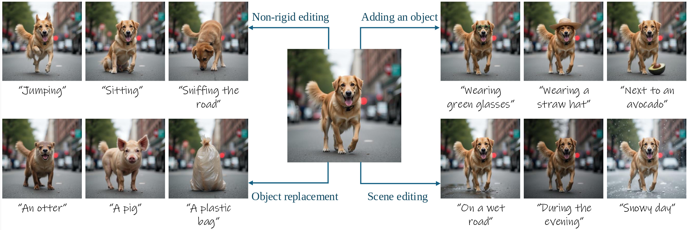
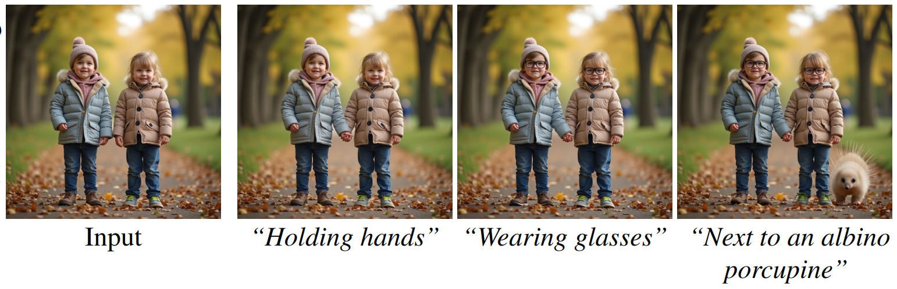
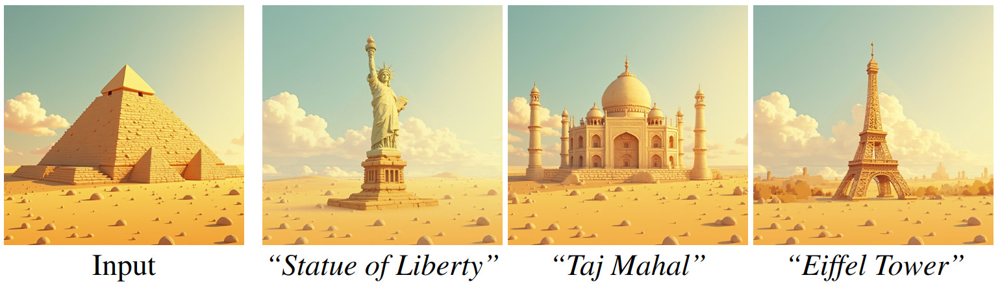
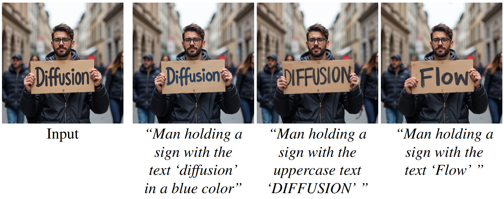

# Stable Flow: Vital Layers for Training-Free Image Editing
<a href="https://omriavrahami.com/stable-flow/"></a>
<a href="https://www.youtube.com/watch?v=_xYhppJj2a0"></a>
<a href="https://arxiv.org/abs/2411.14430"></a>
<a href="https://pytorch.org/">=2.4.1-Red?logo=pytorch"></a>

> <a href="https://omriavrahami.com/stable-flow/">**Stable Flow: Vital Layers for Training-Free Image Editing**</a>
>
> Omri Avrahami, Or Patashnik, Ohad Fried, Egor Nemchinov, Kfir Aberman, Dani Lischinski, Daniel Cohen-Or
>
> Abstract: Diffusion models have revolutionized the field of content synthesis and editing. Recent models have replaced the traditional UNet architecture with the Diffusion Transformer (DiT), and employed flow-matching for improved training and sampling. However, they exhibit limited generation diversity. In this work, we leverage this limitation to perform consistent image edits via selective injection of attention features. The main challenge is that, unlike the UNet-based models, DiT lacks a coarse-to-fine synthesis structure, making it unclear in which layers to perform the injection. Therefore, we propose an automatic method to identify "vital layers" within DiT, crucial for image formation, and demonstrate how these layers facilitate a range of controlled stable edits, from non-rigid modifications to object addition, using the same mechanism. Next, to enable real-image editing, we introduce an improved image inversion method for flow models. Finally, we evaluate our approach through qualitative and quantitative comparisons, along with a user study, and demonstrate its effectiveness across multiple applications.

<p>
      
    <br/>
    A training-free editing method that is able to perform various types of image editing operations, including non-rigid editing, object addition, object removal, and global scene editing. These different edits are done using the same mechanism.
</p>

# Applications

## Incremental Editing 


## Consistent Style


## Text Editing


# Installation
Install the conda virtual environment:
```bash
conda env create -f environment.yml
conda activate stable-flow
```
You may need to update to your own `pytorch-cuda` version.

# Usage

## Generated Images Editing

You need to provide a list of prompts, where the first prompt describes the original scene, and the rest of the prompts describe the edited scene. For example:

```python
[
    "A photo of a dog in standing the street",
    "A photo of a dog sitting in the street",
    "A photo of a dog in standing and wearing a straw hat the street",
    "A photo of a mink",
]
```

Then, you can generate a batch of the image and its edited versions using:
```bash
python run_stable_flow.py \
--hf_token YOUR_PERSONAL_HUGGINGFACE_TOKEN \
--prompts "A photo of a dog in standing the street" \
"A photo of a dog sitting in the street" \
"A photo of a dog in standing and wearing a straw hat the street" \
"A photo of a mink"
```
where `YOUR_PERSONAL_HUGGINGFACE_TOKEN` is your [personal HuggingFace user access token](https://huggingface.co/docs/hub/en/security-tokens).

Then, the results will be saved to `outputs/result.jpg`, or any other path you specify under `--output_path`.

### Low GPU VRAM Usage
All the experiments in our paper were conducted using a single NVIDIA V100 GPU of 80GB VRAM. If you are using a GPU with smaller VRAM and getting `CUDA out of memory` errors, you can use [CPU offloading](https://huggingface.co/docs/diffusers/en/optimization/memory) by adding the `--cpu_offload` flag. It will reduce memory consumption but it will increase the inference time significantly.

## Real Images Editing (Optional)

If you want to edit a real image, you still need to provide a list of prompts, where the first prompt describes the input image and the rest of the prompts describe the edited scene. For example:

```bash
python run_stable_flow.py \
--hf_token YOUR_PERSONAL_HUGGINGFACE_TOKEN \
--input_img_path inputs/bottle.jpg \
--prompts "A photo of a bottle" \
"A photo of a bottle next to an apple"
```
where `YOUR_PERSONAL_HUGGINGFACE_TOKEN` is your [personal HuggingFace user access token](https://huggingface.co/docs/hub/en/security-tokens), and `--input_img_path` is the path to the input image. 

Then, the results will be saved to `outputs/result.jpg`, or any other path you specify under `--output_path`.


## Citation
If you find this useful for your research, please cite the following:
```bibtex
@misc{avrahami2024stableflow,
    title={Stable Flow: Vital Layers for Training-Free Image Editing}, 
    author={Omri Avrahami and Or Patashnik and Ohad Fried and Egor Nemchinov and Kfir Aberman and Dani Lischinski and Daniel Cohen-Or},
    year={2024},
    eprint={2411.14430},
    archivePrefix={arXiv},
    primaryClass={cs.CV},
    url={https://arxiv.org/abs/2411.14430}, 
}
```